# JBS Security Platform — Mini-SOC Engineering

Public-safe showcase of a real self-hosted security intelligence platform.

**Live demo:** https://www.johnnyserver.pl
**Project type:** Linux/VPS security intelligence, mini-SOC dashboard, deterministic audit pipeline
**Stack:** Python, FastAPI, Linux, Bash, HTML/CSS, Vanilla JavaScript, pytest, local Ollama/Llama-style AI support
**Repository status:** public portfolio-safe extract
**Full source status:** private production repository

---

## Executive Summary

JBS Security Platform is a real self-hosted security intelligence project built around Linux/VPS security evidence.

The system was designed to collect, normalize and analyze security signals such as authentication activity, recurring attack sources, host audit results, runtime network context, historical audit runs, deterministic risk decisions and AI-assisted analyst explanations.

This public repository does **not** contain the full private application. It contains a safe technical case study: redacted screenshots, simplified code snippets, validation examples and engineering documentation.

The goal of this repository is to show what was built, how the system is structured, and how security decisions are validated — without exposing private operational data, raw logs, secrets or production source code.

---

## Live Demo

The project has a public demo page:

**https://www.johnnyserver.pl**

The demo presents the visual and operational concept of the platform: mini-SOC dashboard, attack intelligence views, analytics, investigation workflow and AI-assisted analysis.

The public demo and this repository intentionally avoid exposing private runtime data, raw logs, secrets, local configuration, firewall state or production source code.

---

## What this project demonstrates

- Python backend engineering
- FastAPI-style API design
- Linux/VPS security monitoring
- authentication-event analysis
- attack-source classification
- deterministic policy decisions
- pytest-based validation
- mini-SOC dashboard UI
- LIVE runtime intelligence vs historical analytics separation
- local AI analyst support using an Ollama/Llama-style workflow
- secure public sharing discipline
- validation-before-release engineering workflow

---

## Screenshots

The screenshots below are redacted/public-safe visual assets prepared for this repository.

### Dashboard live overview

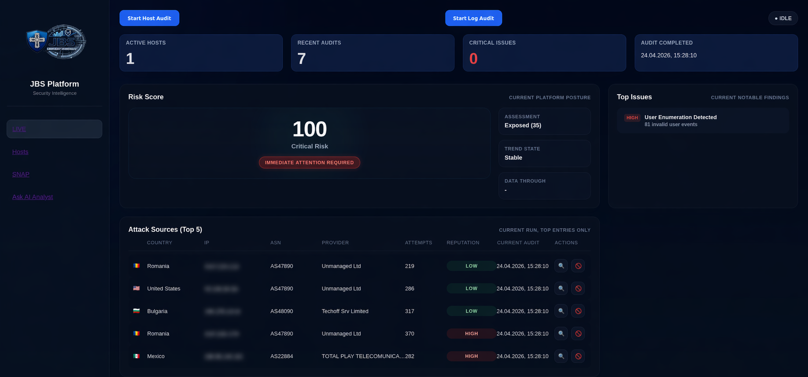

### Historical analytics view

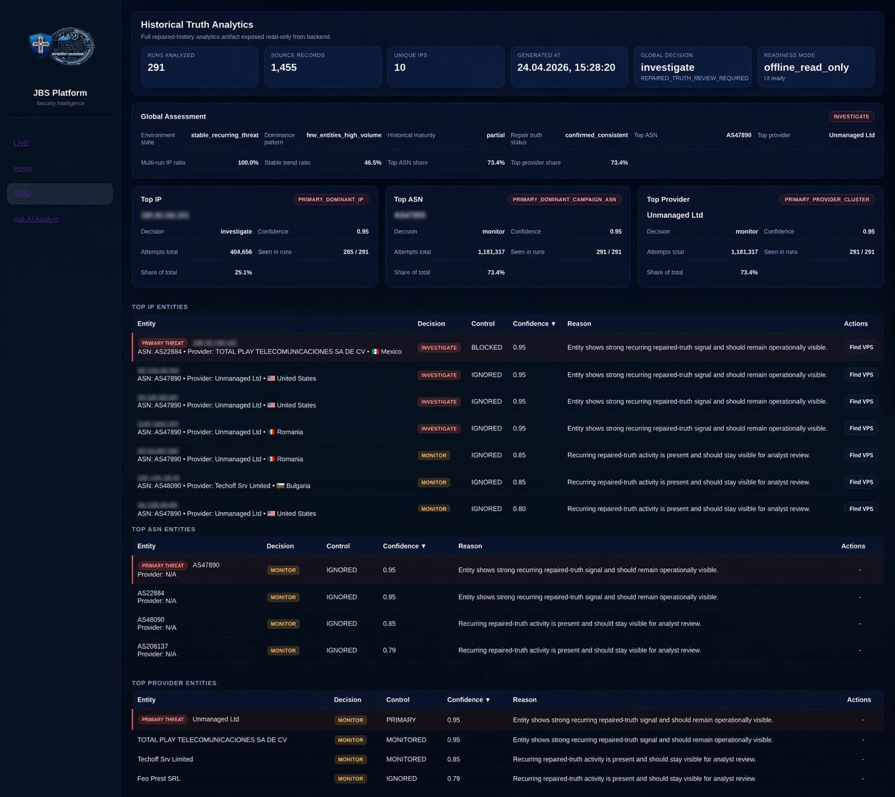

### AI analyst interface

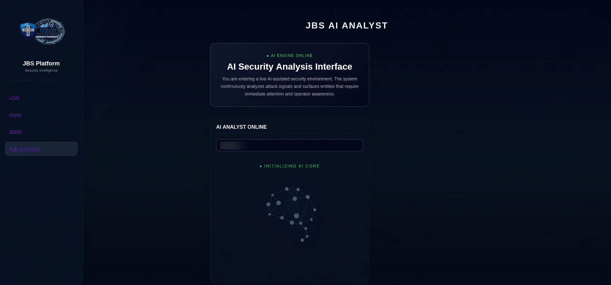

### AI-assisted decision view

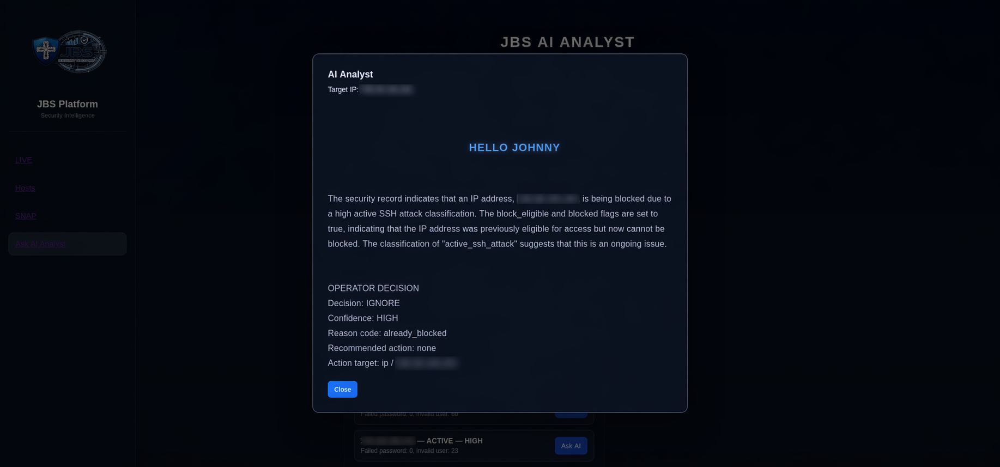

### Attack-source detail view

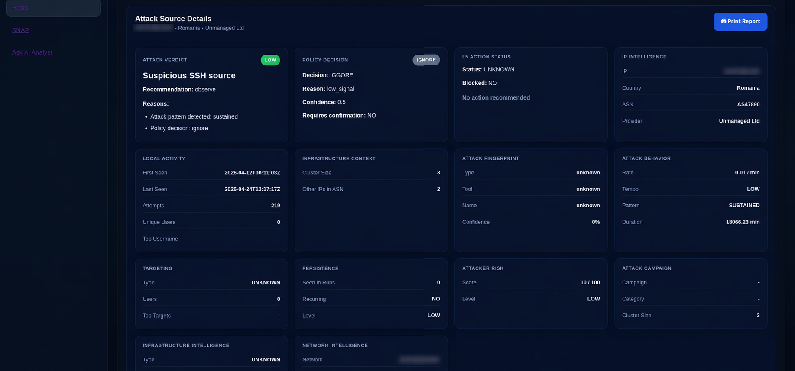

### Live attack intelligence

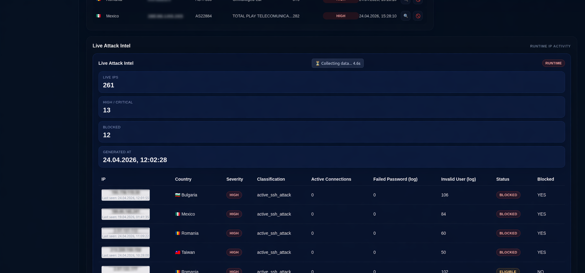

### Audit lifecycle view

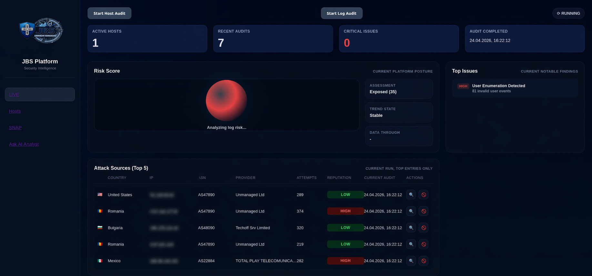

### Entity investigation overview

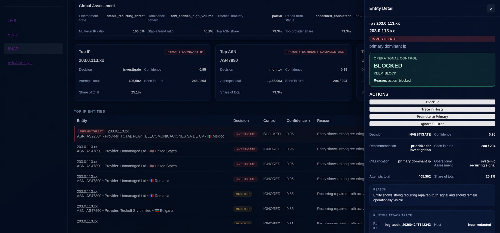

### Monitoring interface

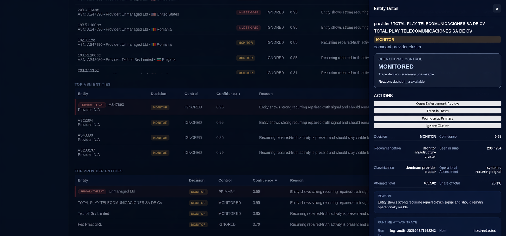

### Wide dashboard overview

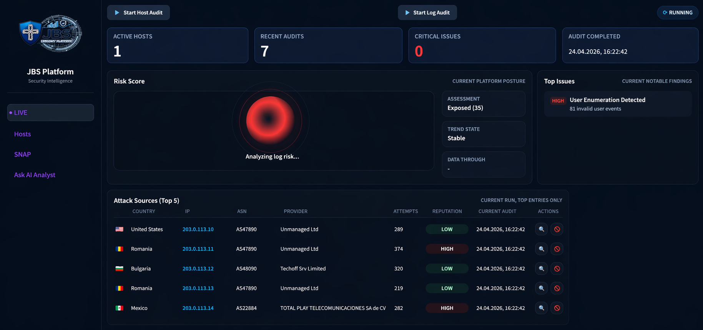

### Public repository structure

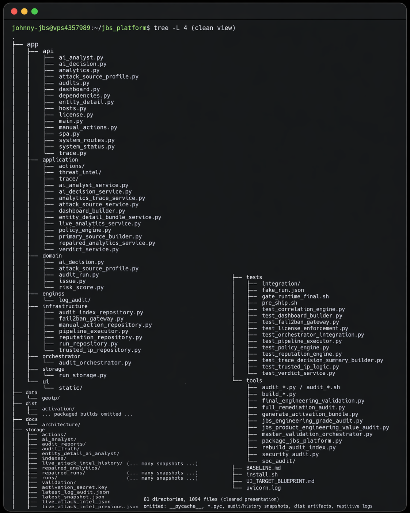

---

## Public repository structure

```text
.
├── docs/
├── index.html
├── README.md
├── screenshots/
├── snippets/
│   ├── ai_llama_decision_example.py
│   ├── fastapi_route_example.py
│   ├── policy_decision_example.py
│   ├── pytest_policy_example.py
│   └── validation_gate_example.sh
└── validation/
    └── git_engineering_history.md
```

This repository is a public-safe extract of the real project, not the full source tree.

It is intentionally focused on architecture, screenshots, representative snippets and validation examples so the project can be reviewed without exposing operational internals.

---

## Public code snippets

The `snippets/` directory contains simplified examples that demonstrate the engineering approach.

| File | Purpose |
|---|---|
| `fastapi_route_example.py` | Example FastAPI-style API route |
| `policy_decision_example.py` | Deterministic attack-source decision logic |
| `pytest_policy_example.py` | Tests for the deterministic policy sample |
| `ai_llama_decision_example.py` | Local Ollama/Llama-style analyst support pattern with deterministic fallback |
| `validation_gate_example.sh` | Public validation gate for snippets |

These snippets are not the full private application. They are small, safe examples showing the structure and reasoning style used in the real project.

---

## Deterministic policy before AI

The AI layer is designed as analyst support, not as an uncontrolled autonomous system.

The pattern is:

1. deterministic policy evaluates the signal first,
2. the AI layer can explain or summarize the decision,
3. the deterministic result remains the source of truth,
4. local Llama/Ollama support is optional,
5. validation works even when no local model is available.

Run the AI sample:

```bash
python3 snippets/ai_llama_decision_example.py
```

Optional local model settings:

```bash
OLLAMA_URL=http://127.0.0.1:11434
OLLAMA_MODEL=llama3.2:1b
```

If Ollama is unavailable, the sample safely falls back to deterministic local policy output.

---

## Validation

Run the public validation gate:

```bash
bash snippets/validation_gate_example.sh
```

Expected result:

```text
Public code samples validated successfully.
```

The validation gate checks:

- Python syntax compilation,
- deterministic policy sample execution,
- optional local AI/Llama sample execution,
- pytest policy tests.

---

## Engineering value

This project demonstrates more than UI screenshots.

The full private system was built around:

- security-oriented data processing,
- deterministic audit artifacts,
- backend API boundaries,
- frontend/backend integration,
- LIVE runtime intelligence,
- historical analytics,
- attack-source enrichment,
- analyst decision support,
- validation gates,
- safe refactoring discipline.

This public repository shows the project in a way that is safe to share with recruiters, reviewers and technical interviewers.

---

## What is intentionally excluded

This public repository does not include:

- full production source code,
- raw system logs,
- runtime datasets,
- GeoIP databases,
- local firewall state,
- fail2ban state,
- generated audit snapshots,
- private storage artifacts,
- deployment secrets,
- `.env` files,
- SSH keys,
- production configuration,
- private source history.

The full JBS Security Platform remains private.

---

## Short project summary

I built and operated a self-hosted Python/FastAPI security intelligence platform in a real Linux/VPS environment. The system analyzes live security signals and presents them through a browser-based mini-SOC dashboard.

The project includes deterministic attack-source decisions, live attack intelligence, historical analytics, redacted investigation views, local AI analyst support, validation tooling and automated tests.

My main focus was auditability, deterministic processing, backend architecture, security reasoning, safe refactoring and validation before release.
